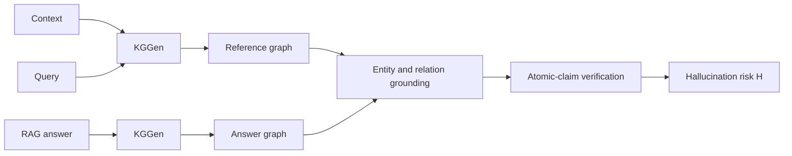

# Evidence-Grounded RAG Hallucination Detection

Knowledge-graph and atomic-claim verification for detecting unsupported statements in RAG answers.


> This is Artemiy Maslov's maintained fork of the [original team repository](https://github.com/Kondachello/rag-hallucination-detection). The research was completed by four co-authors with equal contribution; upstream remains the canonical team history.

## Result

On a fixed held-out RAGTruth QA split, the best `support-critical` configuration achieved:

| Method | ROC-AUC | F1 | Precision / Recall |
|---|---:|---:|---:|
| `strict` | 0.755 [0.676, 0.835] | 0.721 [0.639, 0.793] | 0.639 / 0.827 |
| `support` | 0.730 [0.648, 0.816] | 0.695 [0.611, 0.773] | 0.640 / 0.760 |
| `support-critical` | **0.849 [0.784, 0.909]** | **0.798 [0.726, 0.862]** | **0.704 / 0.920** |

This is a **+0.095 ROC-AUC** improvement over the reproduced HalluGraph-style baseline. Parameters and thresholds were selected on training data only. The held-out evaluation contains 147 valid answers from a deterministic 750-answer manifest; three answers were not scored because graph extraction returned an empty graph.

The result comes from one fixed manifest and is not an independent replication. See the [OpenReview paper](https://openreview.net/forum?id=5nEiOJwG17) for the full study.

## Method

For each RAGTruth triple `(context C, query Q, answer A)`, the pipeline extracts:

```text
G_c = KGGen(C)       G_q = KGGen(Q)       G_a = KGGen(A)
G_ref = G_c union G_q
```

It then measures whether answer entities, directed relations, and atomic claims are supported by `G_ref`. Higher risk `H` means more unsupported content.



| Mode | Logic |
|---|---|
| `strict` | Entity matching and directed-relation preservation. |
| `support` | A relation counts only when supported by the context or query. |
| `support-critical` | Adds atomic-claim checks and emphasizes the highest-risk claims. |

For the selected configuration (`alpha=1.0`, `beta=0.5`, `k=3`, `lambda=0.0`):

```text
H_critical = 0.5 * (1 - EG) + 0.5 * H_top3
```

## Evaluation discipline

- fixed train/test separation;
- five-fold parameter selection on the training split only;
- bootstrap confidence intervals;
- content-addressed extraction cache;
- deterministic offline test doubles;
- explicit reporting of empty graph extractions.

## Quick start

```bash
python -m venv .venv
source .venv/bin/activate
pip install -r requirements.txt
pytest -q
```

Run the complete offline pipeline without an API key:

```bash
python tests/make_fixture.py tests/fixture_data
python run.py --stage all --fake-extractor \
  --data-dir tests/fixture_data --output-dir results_smoke
```

For a live extraction run, configure the model and API-key environment variable in [`config.yaml`](config.yaml). Never put credentials in configuration files, command arguments, logs, or archives.

## Repository map

```text
run.py                 extract -> score -> tune -> evaluate
src/extract.py         KGGen extraction, retries, and cache
src/matching.py        entity and directed-relation matching
src/metrics.py         grounding metrics and risk score
src/tune.py            train-only parameter selection
src/evaluate.py        metrics, bootstrap intervals, and reports
tests/                 offline regression tests
config.yaml            experiment configuration
```

## Artemiy's role

Artemiy formed and led the four-person research team, set the experimental roadmap, divided research and engineering workstreams, and coordinated evaluation and paper delivery. His main technical contribution was the evidence-grounding score connecting the query, retrieved context, and generated answer through entity/relation grounding and atomic-claim verification.

## Paper and attribution

A. Maslov, E. Rutkovskii, N. Gavrishok, A. Kondakov. *What Does the Graph Contribute? Evidence-Grounded Claim Verification for RAG Hallucination Detection.* SMILES 2026 Projects & Proceedings, Skoltech AI Center. [OpenReview](https://openreview.net/forum?id=5nEiOJwG17).

Related work: [HalluGraph](https://arxiv.org/abs/2512.01659), [KGGen](https://arxiv.org/abs/2502.09956), and [RAGTruth](https://arxiv.org/abs/2401.00396).

MIT licensed. See [`LICENSE`](LICENSE).
