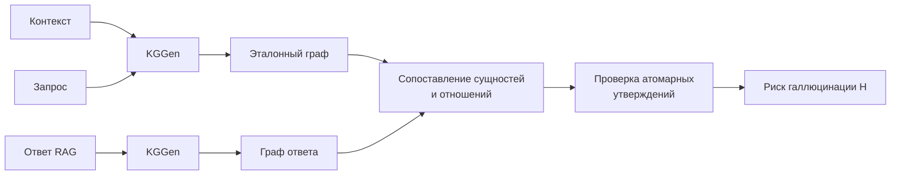

# Детекция галлюцинаций в RAG через графы знаний

> Evidence-grounded верификация утверждений в ответах RAG: графы знаний KGGen, сопоставление с контекстом и проверка атомарных claims. Исследовательский проект и статья на SMILES 2026, Skoltech AI Center.


## Главный результат

На фиксированном отложенном подмножестве RAGTruth QA лучший вариант `support-critical` достиг следующих значений:

| Метод | ROC-AUC | F1 | Precision / Recall |
|---|---:|---:|---:|
| `strict` | 0.755 [0.676, 0.835] | 0.721 [0.639, 0.793] | 0.639 / 0.827 |
| `support` | 0.730 [0.648, 0.816] | 0.695 [0.611, 0.773] | 0.640 / 0.760 |
| `support-critical` | **0.849 [0.784, 0.909]** | **0.798 [0.726, 0.862]** | **0.704 / 0.920** |

Это **+0.095 ROC-AUC** к воспроизведённому HalluGraph-подходу. Параметры и пороги классификации выбирались только на обучающей части. Отложенная оценка содержит 147 валидных ответов из детерминированного манифеста на 750 ответов; три ответа невозможно оценить из-за пустого графа.

> Результат получен на одном фиксированном манифесте и не является независимой репликацией. Репозиторий сохраняет исследовательский код и воспроизводимую базовую реализацию; статья доступна на [OpenReview](https://openreview.net/forum?id=5nEiOJwG17).

## Идея метода

Для каждой тройки RAGTruth `(контекст C, запрос Q, ответ A)` извлекаются графы:

```text
G_c = KGGen(C)       G_q = KGGen(Q)       G_a = KGGen(A)
G_ref = G_c ∪ G_q
```

Далее измеряется, насколько сущности и направленные отношения из графа ответа подтверждаются эталонным графом `G_ref`. Чем выше итоговый риск `H`, тем вероятнее наличие неподтверждённых утверждений.



| Режим | Логика |
|---|---|
| `strict` | Сопоставление сущностей и сохранение направленных отношений в стиле HalluGraph. |
| `support` | Отношение засчитывается только при текстовом подтверждении в контексте или запросе. |
| `support-critical` | Дополнительно проверяются атомарные утверждения; в итоговый скор входят самые рискованные claims. |

Для выбранной конфигурации `alpha=1.0`, `beta=0.5`, `k=3`, `lambda=0.0` итоговый скор упрощается до:

```text
H_critical = 0.5 × (1 − EG) + 0.5 × H_top3
```

## Защита эксперимента

- Разделение train/test, пятифолдовая настройка на train, пороги и параметры запуска фиксируются в артефактах.
- Кэш адресуется содержимым и учитывает вход, модель, версию промпта и настройки извлечения.
- Для unit-тестов используются детерминированные заглушки, поэтому сеть и GPU не нужны.
- Случаи с пустыми графами учитываются явно, а не скрываются импутацией без отчёта.

## Локальный запуск

```bash
python -m venv .venv
source .venv/bin/activate
pip install -r requirements.txt
pytest -q
```

Проверка всего пайплайна без API-ключа и сетевых вызовов:

```bash
python tests/make_fixture.py tests/fixture_data
python run.py --stage all --fake-extractor \
  --data-dir tests/fixture_data --output-dir results_smoke
```

Для живого запуска укажите модель и переменную окружения с API-ключом в [`config.yaml`](config.yaml). Ключ нельзя хранить в конфигурации, аргументах команд, логах или архивах.

## Структура

```text
run.py                 этапы extract → score → tune → evaluate
src/extract.py         извлечение KGGen, повторные попытки и кэш
src/matching.py        сопоставление сущностей и направленных отношений
src/metrics.py         Entity Grounding, Relation Preservation и риск H
src/tune.py            выбор параметров только на обучающей части
src/evaluate.py        метрики, bootstrap-интервалы и отчёт
tests/                 офлайн-регрессионные тесты
config.yaml            единая конфигурация эксперимента
```

## Публикация

A. Maslov, E. Rutkovskii, N. Gavrishok, **A. Kondakov**. *What Does the Graph Contribute? Evidence-Grounded Claim Verification for RAG Hallucination Detection.* SMILES 2026 Projects & Proceedings, Skoltech AI Center. [OpenReview](https://openreview.net/forum?id=5nEiOJwG17)

Работа выполнена четырьмя соавторами с равным вкладом.

## Ссылки

- Noël et al. — [HalluGraph](https://arxiv.org/abs/2512.01659)
- Mo et al. — [KGGen](https://arxiv.org/abs/2502.09956)
- Niu et al. — [RAGTruth](https://arxiv.org/abs/2401.00396)

## Лицензия

MIT — см. [`LICENSE`](LICENSE).
